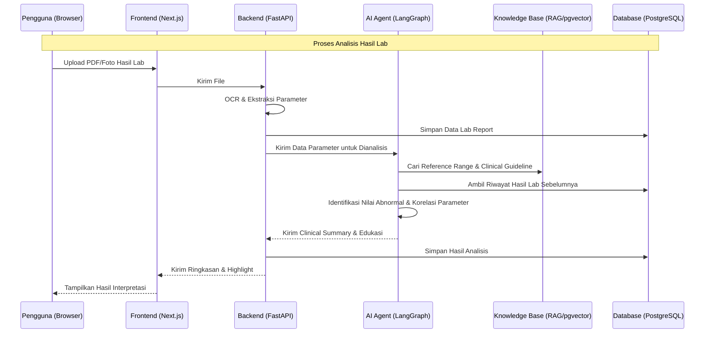
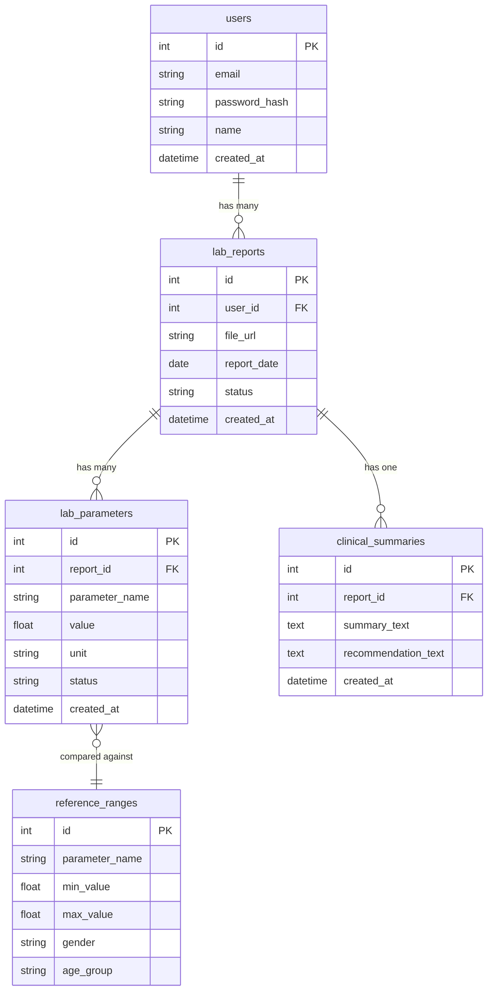

# PRD — Project Requirements Document
## Clinical Blood Report Intelligence Assistant (LabInsight AI)

## 1. Overview
Aplikasi ini bertujuan menjawab masalah umum di masyarakat: banyak pasien menerima hasil laboratorium darah tetapi tidak memahami arti dari nilai-nilai tersebut, sehingga sering merasa cemas atau justru mengabaikan hasil yang sebenarnya penting untuk ditindaklanjuti.

Tujuan utama aplikasi adalah menyediakan platform berbasis web yang membantu pengguna **mengunggah hasil laboratorium darah**, lalu mendapatkan **interpretasi edukatif** yang mudah dipahami — lengkap dengan highlight nilai abnormal, penjelasan tiap parameter, dan rekomendasi tindak lanjut yang aman.

**Positioning penting:** Aplikasi ini **tidak** melakukan diagnosis. Fokusnya adalah edukasi pasien dan dukungan keputusan (*clinical decision support*), sehingga semua output harus selalu mengarahkan pengguna untuk berdiskusi dengan tenaga kesehatan yang merawat.

## 2. Requirements
Berikut adalah persyaratan tingkat tinggi untuk pengembangan sistem:
- **Aksesibilitas:** Aplikasi dapat diakses melalui Web Browser (desktop maupun mobile), dengan alur unggah dokumen yang ramah pengguna awam.
- **Pengguna:** Sistem dirancang untuk pengguna individu (pasien/masyarakat umum) yang mengunggah hasil labnya sendiri. Tidak ada peran admin/multi-tenant di MVP.
- **Data Input:** Input berupa file PDF/foto hasil laboratorium. Ekstraksi data dilakukan otomatis melalui OCR atau model vision, bukan input manual per parameter.
- **Positioning Klinis:** Seluruh output wajib bersifat edukatif, disertai disclaimer bahwa hasil bukan pengganti penilaian dokter, dan tidak boleh berisi kalimat yang menyerupai diagnosis penyakit.
- **Keamanan Data:** Data hasil lab tergolong data kesehatan sensitif, sehingga wajib dienkripsi saat disimpan dan tidak dibagikan ke pihak ketiga.
- **Notifikasi:** Nilai abnormal ditampilkan secara visual (color-coded) langsung pada halaman ringkasan hasil, tanpa memerlukan sistem notifikasi terpisah di MVP.

## 3. Core Features
Fitur-fitur kunci yang harus ada dalam versi pertama (MVP):

1.  **Upload Hasil Lab**
    - Upload file PDF atau foto hasil laboratorium.
    - Ekstraksi otomatis nilai parameter (misal Hb, WBC, Platelet, Creatinine, AST, ALT) melalui OCR/vision model.
2.  **Ringkasan Hasil Otomatis**
    - AI membaca seluruh parameter dan menyusun ringkasan singkat (misal: "Leukosit meningkat, AST dan ALT meningkat, Kreatinin sedikit meningkat").
3.  **Penjelasan Per Parameter**
    - Untuk setiap parameter, AI menjelaskan: fungsi, nilai normal, arti bila tinggi/rendah, kemungkinan penyebab umum, dan pemeriksaan lanjutan yang mungkin dipertimbangkan.
4.  **Highlight Status Abnormal**
    - Indikator visual per parameter: 🟢 Normal, 🟡 Sedikit meningkat/menurun, 🔴 Tinggi/Rendah signifikan.
5.  **Patient-Friendly Summary**
    - Ringkasan akhir dalam bahasa awam yang menekankan bahwa hasil perlu didiskusikan bersama dokter, bukan kesimpulan final.

## 4. User Flow
Alur kerja sederhana bagi pengguna saat menggunakan aplikasi:

1.  **Login/Register:** Pengguna masuk menggunakan email dan password.
2.  **Upload Hasil Lab:** Pengguna mengunggah file PDF/foto hasil laboratorium terbaru.
3.  **Proses Ekstraksi:** Sistem melakukan OCR/ekstraksi data dan menampilkan tabel parameter yang terdeteksi untuk dikonfirmasi pengguna.
4.  **Analisis AI Agent:** Sistem menjalankan alur agentic — mengecek rentang rujukan, mencari guideline klinis relevan, mengecek kombinasi parameter yang saling berkaitan, lalu menyusun ringkasan.
5.  **Tampilan Hasil:** Pengguna melihat ringkasan klinis, penjelasan tiap parameter, highlight abnormal, dan rekomendasi follow-up.
6.  **Riwayat:** Pengguna dapat melihat hasil lab sebelumnya untuk membandingkan tren antar waktu.

## 5. Architecture
Berikut adalah gambaran arsitektur sistem dan alur agentic secara teknis namun sederhana:

## 6. Database Schema

Berikut adalah Entity Relationship Diagram (ERD) yang menggambarkan struktur database utama:

| Tabel | Deskripsi |
|-------|-----------|
| **users** | Data akun pengguna yang mengunggah hasil lab |
| **lab_reports** | Metadata setiap hasil lab yang diunggah (file, tanggal, status pemrosesan) |
| **lab_parameters** | Nilai parameter individual yang diekstrak dari satu laporan (Hb, WBC, AST, dsb.) |
| **reference_ranges** | Rentang rujukan normal per parameter, disesuaikan usia dan jenis kelamin |
| **clinical_summaries** | Ringkasan klinis dan rekomendasi follow-up hasil analisis AI Agent |

## 7. Design & Technical Constraints
Bagian ini mengatur batasan teknis dan panduan yang harus dipatuhi tanpa mendikte pemilihan library secara kaku.

1.  **High-Level Technology:**
    - **Frontend:** Next.js
    - **Backend:** FastAPI
    - **LLM:** Model bahasa besar dengan kemampuan reasoning klinis
    - **OCR:** OCR khusus dokumen atau model vision bawaan LLM
    - **Knowledge Base:** Panduan interpretasi laboratorium & referensi klinis berbasis RAG
    - **Database:** PostgreSQL
    - **Vector Database:** pgvector
    - **Workflow Agent:** LangGraph
    - **Deployment:** Vercel (frontend) + Railway (backend)

2.  **Batasan Klinis (Non-Negotiable):**
    - Sistem tidak boleh memberikan diagnosis penyakit.
    - Setiap output wajib menyertakan disclaimer edukatif dan anjuran konsultasi ke dokter.
    - Rekomendasi obat/lifestyle bersifat umum, bukan resep atau instruksi medis definitif.

3.  **Typography Rules:**
    - **Sans:** `Geist Mono, ui-monospace, monospace`
    - **Serif:** `serif`
    - **Mono:** `JetBrains Mono, monospace`

## 8. Future Enhancements (Pasca-MVP)
Fitur lanjutan yang dapat dikembangkan setelah MVP stabil:

- **Trend Analysis:** Membandingkan hasil lab antar waktu (misal tren kenaikan Kreatinin) dan memberi peringatan pola yang perlu dievaluasi dokter.
- **Medication Review:** Input daftar obat pengguna untuk dicek potensi interaksi dengan hasil lab abnormal (misal Diclofenac vs kreatinin meningkat).
- **Lifestyle Recommendation:** Saran umum terkait hidrasi, pola makan, aktivitas, dan waktu kontrol ulang — selalu disertai catatan bahwa saran bersifat umum.
- **Medical Calculator Tool:** Perhitungan eGFR otomatis saat kreatinin tinggi (bila usia & jenis kelamin tersedia).
